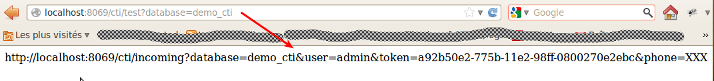

Configuration
=============

Desktop PC
----------

When CTI program is installed on your PC Descktop, when an incoming call arrive it can be possible to open a Web Browser
and launch a specific URL, in this URL it can be possible to pass the phone number in the URL

The ``phone_cti`` connector can be analyse the URL and can return a return a redirect to another URL, eg: open the partner form

Each database containt a specific token to identify the query, and must be pass to the URL, be to help to configure we provide a test URL, that return the real URL

Open a web browser, and launch this URL ``http://localhost:8069/cti/test`` it open this page

You must provide the ``database`` parameter and the name of the database as value like ``http://localhost:8069/cti/test?database=demo_cti``

and see this screenshot

You must copy/paste the URL provide on the CTI component and replace **XXX** on ``phone`` parameter by the substitute value (eg: %1 $1)

For my example, the URL with substitute parameter ``%1``

.. code-block:: text

    http://localhost:8069/cti/incoming?database=demo_cti&user=admin&token=a92b50e2-775b-11e2-98ff-0800270e2ebc&phone=%1

